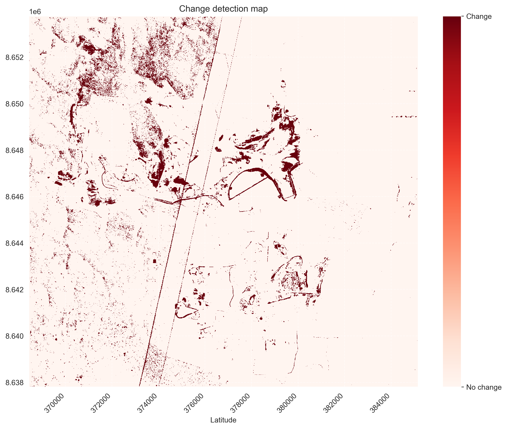
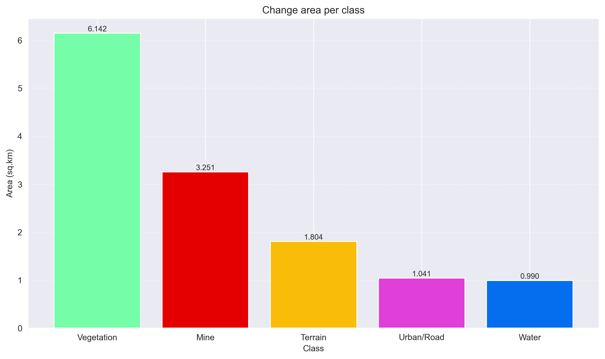

# TECHNICAL ASSIGNMENT: SENTINEL-2 CHANGE ANALYSIS
## 1. Executive Summary

The following report describes the results of a land change analysis performed using two Sentinel-2 images for the mining area of Manyama, Zambia. A land change is considered to occurr when the spectral response at pixel scale was significantly different between images. This geospatial analysis also included a classification algoritm to support the interpretation of results.

| Metric | Value |
|---------|-------|
| **Image 1 date** | 2023-08-12 |
| **Image 2 date** | 2023-09-02 |
| **Total change area** | 13.229 sq.km |
| **Spectral change threshold (percentile)** | 95% |

- **Vegetation**: 6.142 sq.km
- **Mine**: 3.251 sq.km
- **Terrain**: 1.804 sq.km
- **Urban/Road**: 1.041 sq.km
- **Water**: 0.990 sq.km

## 2. Methodology

###    2.1 Classification
**Model**: Random Forest Classifier (200 trees, balanced class weights)

**Training**: Supervised observation points over date 1 scene

**Classes**: Terrain, Vegetation, Water, Mine, Urban/Roads

| Class | Description |
|---------|-------|
| **Terrain** | Bare soil due to deforestation (either mine operation and agriculture) or natural degradation |
| **Vegetation** | Forest and other densely vegetated areas |
| **Water** | Human-made and natural water bodies|
| **Mine** | Exposed subsurface or excavated materials (tailings and gangue) |
| **Urban/Roads** | Paved roads, constructions and other infrastructure footprint |

###    2.2 Change detection

**Method**: PCA (2 components) was performed using Bands + Band ratios + NDVI proxy for a total of 10 variables. PCA captures the main spectral variance, reducing noise and atmospheric effects. Euclidean distance in this reduced space highlights spectral changes between dates.

**Threshold**: Dynamic (percentile 95%), adapting to the data distribution.

**Minimum area of polygons**: 100 sq.m

## 3. Results

###    3.1 Analysis and Interpretation

According to this analysis, the largest changes are observed in vegetation class. Spectra analysis can reveal vegetation changes occurring due to loss of humidity in the soil and atmosphere, and are naturally expected as seasonal changes. This might be the case for the small and disperse areas located in the southern portion of the study area. Nevertheless, the fact that the observed change areas for this class are larger and more dense adjacent to the mine northern perimeter could be an indicator of induced vegetation stress where natural landscape is more fragmented.

The second largest change areas are related to the mine operation. The main areas are observed at the southern portion where open pit is actively operated. Likewise, large changes are observed at the areas designated to store gangue as well as the inner portion of the tailing dam, where loose debris is constantly displaced and humidity is lost.

These two classes account for 70% of the total change area, approximately.

The third class belongs to Terrain, accounting around 14% of the total change area. This class reflect changes in the bare soil that could be related to loss of humidity or erosion, as well as deforested areas. Therefore, this class can indicate where land clearing happened. The dense change areas observed mainly at the borders of the mine operations, particularly at the norther portion of the mine, might reflect expansion of the mining operations; whereas the dispersed small areas at the southern portion of the study area might reflect clearing due to agricultral practices.

Lastly, change areas at Urban/Road and Water classes are similarly low (see "Change area per class" graph below), but occurring spatially different.

As urban constructions and highly compacted paved/unpaved roads are almost impermeable, changes related to humidity or other physical conditions are less expected. Uneven small hotspots are mainly observed at some areas of the active open pit and the southern urban area. The spectral response from this class can be quite similar as the response from mine class. This is particularly observed in small disperse polygons within the urban area at the sourthen portion of the study area.

In the other hand, water polygons are larger and their location is easily identified in the image. Changes related to water bodies are expected to happen as flooding areas can either reduce with evapotranspiration or increase with rainfall. Also, the organic and inorganic composition of the water can induce variability in the spectral response.

**Change map**: 

**Classification map**: 

**Change area per class**: 

###    3.2 Generated database

**Format**: SQLite

**Table**: `change_features`

**Fields**: `id`, `date_before`, `date_after`, `area_m2`, `confidence`, `class`, `geometry_wkt`

## 4. Limitations and recommendations

### 4.1 Limitations

**Radiometric decoupling between scenes**: The composite image consist of two scenes with different optic conditions from collection. This reduces the detection capacity of slight changes (such as vegetation phenology, greeness) in one of the scenes, resulting in underestimation of the areas. In addition, this introduces noise at the edge of scenes as observed in two straight lines across the image, resulting into overestimation of the change areas.

**Classification between dates**: Random Forest model trained with starting date has some limitations when applying to date 2, mainly due to radiometric shift. This introduces classification errors that limits the capacity to determine to which class the changes happened.

**NDVI approach**: NDVI was calculated using green band as a proxy to NIR (B08), which reduces the precision of change detection specially in vegetation areas.

**Normalization based on histogram**: This normalization was applied with the goal of reducing the errors introduced due to radiometric decoupling. However, this didn't improve significantly the results.

### 4.2 Recommendations

**Advanced atmospheric/reflectance correction**: Apply corrections across the whole composite image when downloading the data. This could enhance detections that might be hidden, particularly at the right side scene.

**Improve classification algoritm**: By labeling supervised observations corresponding to the second date, the Random Forest model could be develop to detect type of changes between classes among dates.

**Estimation of spectral index**: Providing more available bands will increase the accuracy of index estimations used for both change detection and classification.

**Environmental compliance and monitoring**: Contrast the changes detected relative to the expansion of the mining operation against the environmental permitting, particularly the Environmental Impact Assessment report. For monitoring purposes, deepen the analysis based on NDVI or other index could support the interpretation and identification of change causes.

## 5. Conclusion

The analysis identified a total change area of 13.229 sq.km. The largest change areas correspond to vegetation cover, possibly due to phenology, natural degradation and induced stress. The second largest change areas correspond to mining operations, particularly at the open pit where excavation occurs and within the areas designated to store gangue and tailings.
- **Vegetation**: 6.142 sq.km
- **Mine**: 3.251 sq.km
- **Terrain**: 1.804 sq.km
- **Urban/Road**: 1.041 sq.km
- **Water**: 0.990 sq.km

---
*Report generated 2026-07-11 04:26:45*
